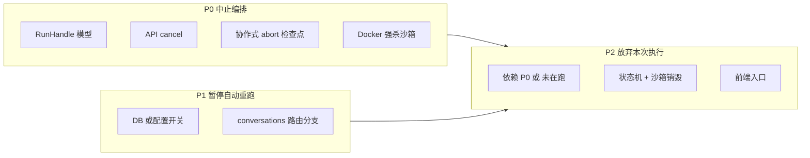

# Orchestrator 人工介入能力：实现优先级（基于当前 `orchestrator-runner` / Core）

本文从 **进程与任务模型** 出发，拆解「中止编排」「暂停自动重跑」「放弃本次执行（含沙箱/状态）」的实现顺序与依赖。

---

## 1. 现状：任务模型长什么样

### 1.1 `backend/src/orchestrator-runner.ts`

| 机制 | 行为 |
|------|------|
| `runningJobs: Set<string>` | 仅按 `requirementId` 去重；`runOrchestratorForRequirement` 入口 `add`，`finally` 里 `delete`。 |
| 提前释放 | 在 `for await` 内若收到 `waiting-for-pm` / `plan-ready` / `diff-ready`，会 **先 `runningJobs.delete` 再 `break`**，以便 PM 回复可再次触发编排（与暂停点设计一致）。 |
| 与 Core 的关系 | `getDeps()` 单例 `Orchestrator` + `DockerSandboxManager`；**无** `AbortController`、**无** 子进程句柄、**无** 按需求取消 LLM 请求的能力。 |
| 异常 | `catch` 里在非终态时把 DB 标为 `failed` 并推 SSE。 |

### 1.2 `core/src/orchestrator/orchestrator.ts`

- `run()` 为 **AsyncGenerator**：澄清 → 方案 → `plan-ready` 暂停；或从 `plan-ready`+`plan` 进入 `phaseCoding`；或从 `diff-ready` 进入 `phaseCommit`。
- 长耗时点：`runClarification`、`agentRunner.run`（方案）、`runCoding` / `skill.execute`、文件 IO、`testRunner.run`（含 lint/test/build）、`executor('git …')`。
- 沙箱：`DockerSandboxManager.create(requirement.id)`，**key 为需求 id**；暂停点设 `sandboxShouldCleanup = false` 以保留容器供后续阶段。
- **结论**：取消必须是 **「协作式（阶段边界检查）+ 资源层强杀（Docker）」** 组合；单靠 `Set` 无法中断正在执行的 `await`。

### 1.3 `core/src/git-ops/docker-sandbox.ts`

- `activeSandboxes: Map<sandboxId, { sandbox, containerName }>`，`sandbox.cleanup()` 会 `docker rm -f` + 删目录。
- 需提供按 **`requirement.id`（即 create 传入的 id）** 查找并 `cleanup` 的显式 API，供「中止 / 放弃」调用。

---

## 2. 目标能力与依赖关系

---

## 3. 实现优先级（建议）

### P0 — 中止 / 取消当前 Orchestrator（必须先做）

**目标**：用户或运维可发起取消；**尽量短**时间内不再写回错误状态、并释放沙箱资源。

| 子项 | 说明 |
|------|------|
| **P0-a：RunHandle 替代裸 `Set`** | `Map<requirementId, { abortController: AbortController, runId: string }>`（或等价 flag）。`isOrchestratorRunning` 改为「存在未完成 handle」；**注意**：当前在 `plan-ready` 等事件处会提前 `delete`，若改为「全程占用直到 `finally`」需同步调整 **PM 自动重跑** 与 **approve-plan** 的互斥语义（见下节「语义决策」）。 |
| **P0-b：API** | 例如 `POST /api/requirements/:id/orchestrator/cancel`：幂等、若未运行返回 204/200。 |
| **P0-c：Core 协作式取消** | `Orchestrator.run(..., options?: { signal: AbortSignal })`：在 **每轮 plan retry 之间**、**每轮 coding 前后**、**testRunner.run 前后**（若可拆）、`phaseCommit` 关键步骤前检查 `signal.aborted`，抛出统一 `AbortError` 或 yield `orchestrator-aborted`。 |
| **P0-d：资源强杀（必配）** | `cancel` 时调用 `DockerSandboxManager.destroyByRequirementId(id)`（新建）：对 `activeSandboxes.get(id)` 执行 `sandbox.cleanup()`，避免 LLM 仍返回但容器已杀的竞争（P0-c 应先置 abort，再杀容器，顺序要文档化）。 |
| **P0-e：runner 收尾** | `catch` 区分 `AbortError`：不覆盖为「失败」或映射为新状态 `cancelled`（需在 `RequirementStatus` 与 VALID_STATUSES 中增加）；`pushEvent` 明确 `aborted` 类型；`finally` 清理 handle。 |

**语义决策（评审点）**：

- **方案 A（推荐）**：`runningJobs` / handle 表示「从触发到 `finally` 整段占用」，在 `plan-ready` / `waiting-for-pm` / `diff-ready` **仍占锁**，则 PM 自动重跑与「再次点运行」需改为：要么排队，要么返回 409「请先结束当前会话」。与「暂停自动重跑」正交。
- **方案 B（保持现状兼容）**：暂停点仍释放锁，则 **编码中** 才可 cancel；澄清/方案阶段 cancel 需另一套「仅杀本次 generator」的引用（不能用 `requirementId` 单 Set）。实现复杂度更高，**不推荐**。

---

### P1 — 可选「暂停自动重跑」（PM 回复后不自动起编排）

**目标**：PM 在 `clarifying` / `waiting-for-pm` 发多条消息整理思路，**不**每次写入都触发 `runOrchestratorForRequirement`。

| 子项 | 说明 |
|------|------|
| **P1-a：持久化开关** | `requirements` 表增加 `auto_run_on_pm_reply`（默认 `true`）或 `orchestrator_paused_until`；或项目级配置。 |
| **P1-b：API/UI** | `PATCH` 切换；前端在对话区增加「暂停/恢复自动运行」。 |
| **P1-c：路由** | `POST .../conversations` 中，若 `role === 'pm'` 且开关关闭，**只写库**，不调用 `runOrchestratorForRequirement`；用户手动点「运行流水线」触发。 |

依赖：无强依赖 P0，但与 P0-A 的锁策略一起设计可避免「暂停期间误触发多次运行」。

---

### P2 — `plan-approved` / `coding` / `testing` 阶段「放弃本次执行」（沙箱 + 状态）

**目标**：在**已确认方案、编码尚未到可提交**的区间，一键回到「可重新决策」的状态，并 **销毁当前沙箱**，避免脏工作区被 `getExisting` 复用。

| 子项 | 说明 |
|------|------|
| **P2-a：前置** | 若 `isOrchestratorRunning`（按 P0 新定义）：**先** `cancel`，等待 `finally` 完成（或异步任务 + 前端轮询状态），再改 DB。 |
| **P2-b：状态回滚策略（需产品拍板）** | **推荐默认**：`plan-ready`（保留 `plan` 与 `structuredRequirement`），表示「方案仍有效，可改文案后再确认或驳回」。可选：**`plan-rejected`** 表示连方案一并作废需重跑方案。 |
| **P2-c：沙箱** | 调用 P0-d `destroyByRequirementId`；确保 `Orchestrator` 下次从 `plan-ready` 进入时 **走新建沙箱分支**（当前逻辑：`getExisting` 仅在 `diff-ready` 复用；从 `plan-ready` 进 `phaseCoding` 若仍持有旧 sandbox 引用需保证 cancel 后 generator 已结束）。 |
| **P2-d：API** | 例如 `POST /api/requirements/:id/abandon-execution`，校验状态白名单：`coding` \| `testing` \| `plan-ready`（若业务上「确认方案后 DB 仍为 plan-ready」）等。 |
| **P2-e：前端** | 进度页或顶部操作区：「放弃本次执行」+ 二次确认文案（与「驳回方案」「撤回变更」区分）。 |

**与现有一致性**：`diff-ready` 下的「撤回变更」已有部分语义（回退到 `coding`）；P2 是 **执行中 / 无满意 diff** 的补集。

---

### P3 — 体验与运维（可后置）

- SSE 事件：`orchestrator-aborted`、`auto-run-paused`。
- 审计表：谁、何时 cancel / abandon。
- LLM Client：`fetch` 传 `signal`（若供应商 SDK 支持），缩短「软取消」等待时间。
- 指标：cancel 耗时、abort 时所在 phase。

---

## 4. 验收建议（按优先级）

| 阶段 | 验收 |
|------|------|
| P0 | 编码长跑测试时点击取消，30s 内 SSE 收到 aborted/failed(cancelled)，容器不在 `docker ps`，同需求可再次 approve/run。 |
| P1 | 关闭自动运行后连发 3 条 PM 消息，后端仅 1 次或 0 次 orchestrator（按设计），手动运行才触发。 |
| P2 | 放弃后 DB 为 `plan-ready`、无残留 `activeSandboxes` 条目；再次确认方案为新沙箱、新 npm install 周期可接受或做镜像缓存优化（另项）。 |

---

## 5. 风险与备注

- **单例 Orchestrator**：cancel 一只需求不应影响其他需求；`abort` 必须按 `requirementId` 维度隔离。
- **generator.return()**：若从外部结束 async generator，需确认 `finally` 中 `sandbox.cleanup` 与 `sandboxShouldCleanup` 仍正确执行（与现有 `return` 路径对齐）。
- **approve-plan 与 PM 自动重跑并发**：锁策略变更后需回归测试。

---

*文档版本：与仓库 `orchestrator-runner.ts` / `Orchestrator` / `DockerSandboxManager` 当前实现对齐，后续实现以代码为准。*
